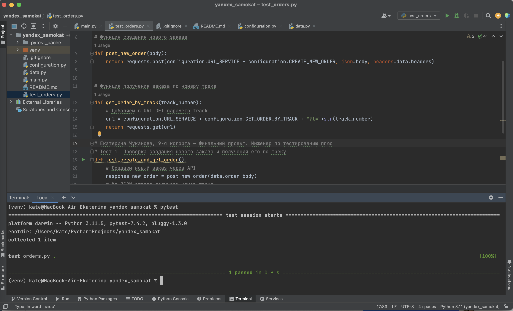

# API Yandex.Самокат. Автотест на создание заказа и запроса на его получение по треку
Автоматизирован сценарий:
1. Клиент создает заказ.
2. Проверяется, что по треку заказа можно получить данные о заказе.

## Использование и требования
- Для запуска тестов должны быть установлены пакеты `pytest` и `requests`
  - Для их установки используйте `pip install pytest`, `pip install requests` 
- Запуск всех тестов выполянется командой `pytest`

## Работа с базой данных
SQL запросы находятся в файле `sql_query.sql`

**Задание 1**  
Представь: тебе нужно проверить, отображается ли созданный заказ в базе данных.
Для этого: выведи список логинов курьеров с количеством их заказов в статусе «В доставке» (поле inDelivery = true).

**Задание 2**  
Ты тестируешь статусы заказов. Нужно убедиться, что в базе данных они записываются корректно.
Для этого: выведи все трекеры заказов и их статусы.   
Статусы определяются по следующему правилу:  
Если поле finished == true, то вывести статус `2`.  
Если поле canсelled == true, то вывести статус `-1`.  
Если поле inDelivery == true, то вывести статус `1`.  
Для остальных случаев вывести `0`.  
